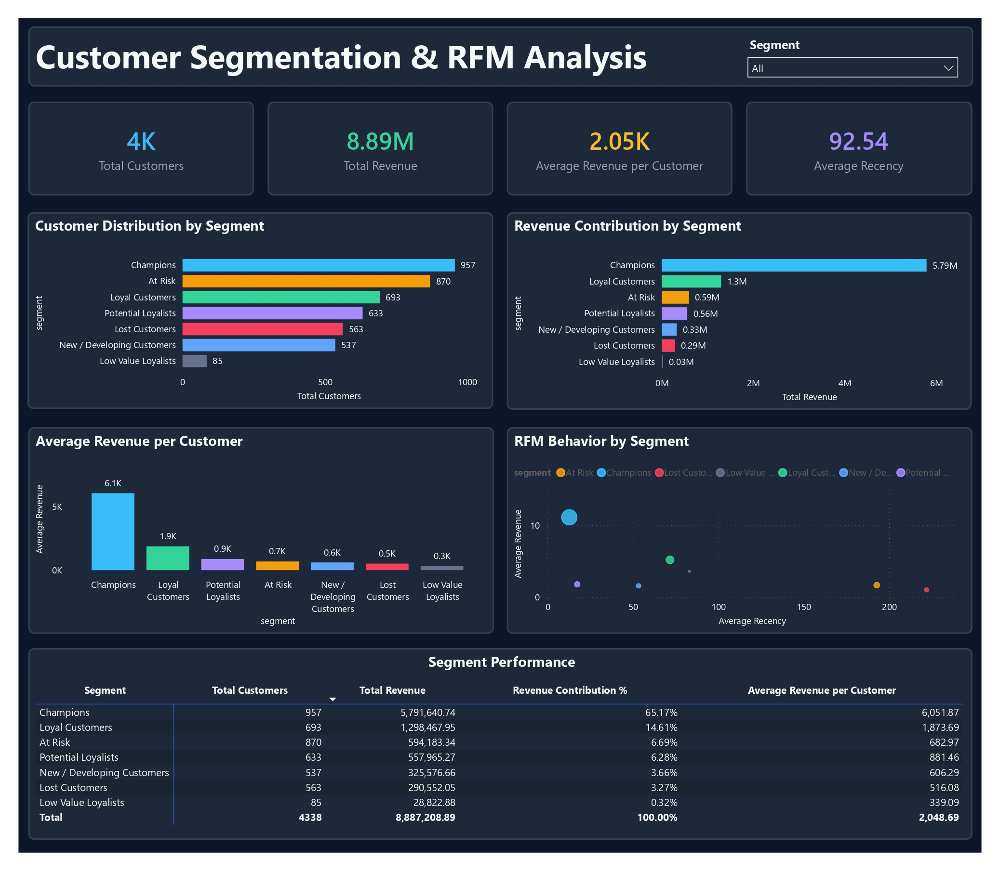

# Customer Segmentation & RFM Analysis

> End-to-end customer analytics project using Python, MySQL, RFM analysis, customer segmentation, and Power BI to identify customer value, retention opportunities, and actionable business strategies.

---

## 📌 Project Overview

Customer behavior varies significantly across a customer base. Treating all customers with the same marketing and retention strategy can lead to inefficient resource allocation and missed revenue opportunities.

This project analyzes transactional retail data to understand customer purchasing behavior, identify high-value and at-risk customers, and develop actionable customer segments using **RFM (Recency, Frequency, Monetary) analysis**.

The project follows an end-to-end Data Analyst workflow:

**Data Understanding → Data Cleaning → Exploratory Data Analysis → SQL Business Analysis → RFM Analysis → Customer Segmentation → Power BI Dashboard → Business Insights → Recommendations**

The analysis uses Python for data preparation and exploratory analysis, MySQL for business analysis, RFM methodology for customer segmentation, and Power BI for interactive visualization.

---

## 🎯 Business Problem

The business needs to better understand its customer base and identify which customers should receive different retention, development, or reactivation strategies.

The main challenges addressed in this project are:

- Identifying the most valuable customers.
- Understanding differences in customer purchasing behavior.
- Identifying customers who may be at risk of becoming inactive.
- Finding customers with potential to become higher-value customers.
- Understanding how revenue is distributed across customer segments.
- Translating customer analytics into actionable business recommendations.

---

## 🎯 Business Objectives

This project aims to:

- Analyze customer purchasing behavior using transactional data.
- Identify high-value, loyal, potential, at-risk, and lost customers.
- Calculate customer-level Recency, Frequency, and Monetary metrics.
- Segment customers using RFM scoring.
- Quantify revenue contribution and customer value by segment.
- Build an interactive Power BI dashboard for customer analysis.
- Translate analytical findings into actionable retention and customer development strategies.

---

## ❓ Business Questions

The analysis answers the following business questions:

1. Who are the most valuable customers?
2. How is revenue distributed across customer segments?
3. Which customer segments have the highest customer value?
4. Which customers or segments may require reactivation or retention efforts?
5. Which customers have potential to develop into higher-value segments?
6. What business strategies should be prioritized for each customer segment?

---

## 📊 Dataset

**Dataset:** Online Retail

**Source:** UCI Machine Learning Repository

### Dataset Overview

| Attribute         | Details                         |
| ----------------- | ------------------------------- |
| Dataset           | Online Retail                   |
| Source            | UCI Machine Learning Repository |
| Time Period       | December 2010 – December 2011   |
| Number of Rows    | 541,909                         |
| Number of Columns | 8                               |
| Business Domain   | Online Retail                   |

The original dataset contains transaction-level information including invoices, products, quantities, prices, customers, dates, and countries.

---

## 🗂️ Data Dictionary

| Column        | Description                                     |
| ------------- | ----------------------------------------------- |
| `InvoiceNo`   | Unique invoice number identifying a transaction |
| `StockCode`   | Product or stock code                           |
| `Description` | Product description                             |
| `Quantity`    | Number of items purchased                       |
| `InvoiceDate` | Date and time of the transaction                |
| `UnitPrice`   | Price per unit                                  |
| `CustomerID`  | Unique customer identifier                      |
| `Country`     | Customer's country                              |

---

## 🧹 Data Cleaning

The raw transactional data was cleaned and prepared before analysis.

Key preparation steps included:

- Converting transaction dates into the appropriate datetime format.
- Reviewing missing values and their business implications.
- Handling records without usable customer identifiers for customer-level analysis.
- Identifying cancelled transactions.
- Handling invalid quantities and prices.
- Validating revenue calculations.
- Reviewing duplicate transaction records.
- Standardizing relevant fields for analysis.
- Creating a cleaned transaction dataset for downstream analysis.

The resulting cleaned transaction data was stored as:

`data/processed/online_retail_cleaned.csv`

A customer-level dataset was subsequently created for customer analysis and segmentation:

`data/processed/online_retail_customer.csv`

---

## 📈 Exploratory Data Analysis

Exploratory analysis was performed using Python to understand overall transaction and customer behavior.

Key analysis areas included:

- Transaction volume.
- Revenue distribution.
- Customer purchasing behavior.
- Product performance.
- Country-level activity.
- Missing customer information.
- Cancelled transactions.
- Duplicate transactions.
- Customer purchasing frequency.
- Customer revenue contribution.

The EDA was used to identify patterns and potential business issues before performing customer segmentation.

---

## 🗄️ SQL Business Analysis

MySQL was used to perform structured business analysis on the cleaned transaction data.

The SQL workflow included:

1. Database and table creation.
2. Data import.
3. Data validation.
4. Business analysis queries.

Key analysis areas included:

- Revenue performance.
- Customer behavior.
- Product performance.
- Country performance.
- Transaction trends.
- Customer purchasing activity.
- Business-level aggregation.

SQL scripts are available in the `sql/` directory.

---

## 🔢 RFM Analysis

RFM analysis was used to quantify customer purchasing behavior based on three dimensions.

### Recency

Recency measures how recently a customer made a purchase.

A lower Recency value indicates more recent purchasing activity.

### Frequency

Frequency measures how often a customer made purchases during the analysis period.

A higher Frequency value indicates more frequent purchasing behavior.

### Monetary

Monetary measures the total analyzed revenue associated with a customer.

A higher Monetary value indicates greater customer value within the analyzed transaction dataset.

### RFM Scoring

Customers were scored independently for:

- Recency
- Frequency
- Monetary

Each dimension received an RFM score from 1 to 5.

The individual scores were combined into an overall RFM score:

`RFM Score = R Score + F Score + M Score`

The resulting customer-level RFM dataset contains:

- 4,338 unique customers.
- Recency.
- Frequency.
- Monetary.
- R Score.
- F Score.
- M Score.
- RFM Score.
- Customer segment.

The final customer-level RFM dataset is stored as:

`data/processed/customer_rfm_segments.csv`

This dataset contains one row per customer and includes the customer's RFM metrics, individual RFM scores, overall RFM score, and assigned customer segment.

---

## 🎯 Customer Segmentation

Customers were grouped into seven segments based on their RFM characteristics.

| Segment                    | Strategic Role                                                |
| -------------------------- | ------------------------------------------------------------- |
| Champions                  | Highest-value customers requiring strong retention            |
| Loyal Customers            | Valuable customers with opportunities for further development |
| Potential Loyalists        | Customers with potential to become more valuable              |
| At Risk                    | Customers requiring reactivation and retention efforts        |
| New / Developing Customers | Customers requiring engagement and development                |
| Lost Customers             | Inactive customers suitable for selective win-back            |
| Low Value Loyalists        | Lower-value customers requiring cost-efficient engagement     |

### Segment Distribution

The final customer-level dataset contains **4,338 customers across 7 segments**.

The largest customer segments are:

- Champions: 957 customers
- At Risk: 870 customers
- Loyal Customers: 693 customers
- Potential Loyalists: 633 customers
- Lost Customers: 563 customers
- New / Developing Customers: 537 customers
- Low Value Loyalists: 85 customers

---

## 📊 Power BI Dashboard

An interactive Power BI dashboard was developed to provide a consolidated view of customer value, segmentation, RFM behavior, and segment performance.

### Dashboard: Customer Segmentation & RFM Analysis

The dashboard includes:

- KPI cards for overall customer and revenue metrics.
- Customer distribution by segment.
- Average revenue per customer by segment.
- RFM behavior scatter analysis.
- Segment performance matrix.
- Interactive segment slicer.
- Cross-filtering between visuals.
- Consistent formatting and visual hierarchy.

### Dashboard Preview



The Power BI source file is available at:

`powerbi/dashboard.pbix`

---

## 💡 Key Insights

### 1. Revenue is highly concentrated among Champions

Champions represent **22.06% of customers** but contribute **65.17% of analyzed revenue**.

This makes Champions the most strategically important segment for customer retention.

### 2. Customer value varies significantly across segments

Champions generate an average analyzed revenue of **6,051.87 per customer**, compared with **1,873.69** for Loyal Customers and **339.09** for Low Value Loyalists.

This demonstrates a substantial difference in customer economic value across segments.

### 3. At Risk customers represent a large customer population

At Risk customers account for approximately **20.06% of the customer base** but contribute only **6.69% of analyzed revenue**.

This creates an opportunity for targeted reactivation and retention campaigns.

### 4. Potential Loyalists provide a customer development opportunity

Potential Loyalists represent **633 customers** and contribute **6.28% of analyzed revenue**.

They can be targeted with strategies designed to increase repeat purchases and move customers toward higher-value segments.

### 5. Lost Customers provide a selective win-back opportunity

Lost Customers represent **563 customers** and contribute **3.27% of analyzed revenue**.

Win-back activities should prioritize customers with stronger historical value rather than applying the same strategy to every inactive customer.

---

## 🚀 Business Recommendations

| Segment                    | Recommended Strategy                                                               |
| -------------------------- | ---------------------------------------------------------------------------------- |
| Champions                  | Prioritize retention, VIP benefits, personalization, and exclusive offers          |
| Loyal Customers            | Encourage repeat purchases, cross-selling, and progression toward Champions        |
| Potential Loyalists        | Use loyalty programs, personalized recommendations, and repeat-purchase incentives |
| At Risk                    | Launch targeted reactivation and retention campaigns                               |
| New / Developing Customers | Encourage second and third purchases through engagement and onboarding strategies  |
| Lost Customers             | Use selective win-back campaigns based on historical customer value                |
| Low Value Loyalists        | Use cost-efficient engagement and targeted product recommendations                 |

The detailed business analysis, quantified impact, recommendations, and limitations are documented in [`docs/business_analysis.md`](docs/business_analysis.md).

---

## 🛠️ Tools & Technologies

### Python

- Pandas
- NumPy
- Matplotlib
- Seaborn
- Jupyter Notebook

### SQL

- MySQL

### Business Intelligence

- Power BI
- DAX

### Version Control

- Git
- GitHub

---

## 📁 Project Structure

```text
customer-segmentation-analysis/
│
├── data/
│   ├── raw/
│   │   └── online_retail.xlsx
│   │
│   └── processed/
│       ├── online_retail_cleaned.csv
│       ├── online_retail_customer.csv
│       └── customer_rfm_segments.csv
│
├── notebooks/
│   ├── 01_data_profiling.ipynb
│   ├── 02_data_cleaning.ipynb
│   ├── 03_eda.ipynb
│   └── 04_rfm_analysis.ipynb
│
├── sql/
│   ├── business_analysis.sql
│   ├── import_data.sql
│   ├── schema.sql
│   └── validation.sql
│
├── powerbi/
│   └── dashboard.pbix
│
├── docs/
│   └── business_analysis.md
│
├── images/
│   └── dashboard.png
│
├── .gitignore
├── README.md
└── requirements.txt
```

---

## 📚 References

- UCI Machine Learning Repository — Online Retail Dataset

---

## 👤 Author

**Muhamad Rukhul Kirom**

Data Analyst Portfolio Project

---

## 📌 Project Status

**Status:** Completed

**Last Updated:** August 2026

```

```
